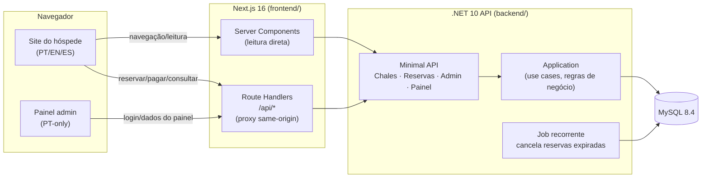

# 🏔️ Chalé Online

**Site de reservas diretas para uma pousada fictícia de 12 chalés rústicos em Campos do Jordão (Brasil)** — projeto full-stack de portfólio com busca por disponibilidade, reserva com bloqueio anti-overbooking em nível de banco de dados, pagamento simulado, consulta de reserva, interface trilíngue (PT/EN/ES) e um painel administrativo completo.

[](backend/)
[](frontend/)
[](frontend/)
[](frontend/)
[](backend/)
[](frontend/lib/i18n/messages/)

---

## Sobre o projeto

Chalé Online simula uma experiência completa de reserva direta (sem intermediário/OTA) para uma pequena pousada de montanha. Um hóspede pode navegar pelo catálogo, buscar disponibilidade por data, ver o detalhe de cada chalé com avaliações reais, criar uma reserva protegida contra overbooking, "pagar" (simulado — sem gateway real) e consultar sua reserva depois por um código único. A proprietária, "Antônio", tem um painel administrativo separado para ver a ocupação diária dos 12 chalés e o relatório financeiro mensal.

Este não é um CRUD de exemplo — é um projeto pensado para expor decisões de engenharia reais: concorrência resolvida no nível certo, separação de responsabilidades entre frontend e backend, internacionalização de ponta a ponta (incluindo mensagens de erro dinâmicas), e uma suíte de testes que prova comportamento real em vez de simular com mocks.

## 📸 Screenshots

> _Espaço reservado — capturas de tela reais ainda não incluídas neste repositório._
>
> Sugestão de como preencher: suba o projeto localmente (veja [Como rodar](#-como-rodar-localmente) abaixo) e capture as telas a seguir, salvando em `docs/screenshots/` com esses nomes:
>
> | Tela | Arquivo sugerido |
> |---|---|
> | Home com catálogo completo + busca | `docs/screenshots/home.png` |
> | Detalhe do chalé (galeria + avaliações) | `docs/screenshots/detalhe-chale.png` |
> | Formulário de reserva | `docs/screenshots/reserva.png` |
> | Consulta de reserva por código | `docs/screenshots/consulta.png` |
> | Home em inglês ou espanhol (`/en` ou `/es`) | `docs/screenshots/home-en.png` |
> | Painel administrativo — Visão Diária | `docs/screenshots/admin-visao-diaria.png` |
> | Painel administrativo — Relatório Mensal | `docs/screenshots/admin-relatorio.png` |
>
> Depois é só trocar este bloco pelas tags `` de cada imagem.

## ✨ Funcionalidades

**Lado do hóspede**
- 🔎 Busca de disponibilidade por data, com filtro por estrutura (quartos/banheiros)
- 🏡 Página de detalhe do chalé — galeria de fotos/vídeo, comodidades, avaliações reais
- 📅 Reserva com **bloqueio anti-overbooking real**, garantido por constraint de banco de dados, não por lógica de aplicação
- 💳 Pagamento simulado, com janela de 48h para confirmação antes do cancelamento automático
- 🔗 Consulta de reserva por código único, sem necessidade de conta/login
- ⭐ Exibição de avaliações pré-cadastradas
- ❓ FAQ
- 🌐 Interface completa em **Português, Inglês e Espanhol** — inclusive as mensagens de erro dinâmicas vindas da API

**Painel administrativo**
- 🔐 Autenticação JWT (validade fixa de 2h, bloqueio temporário após tentativas malsucedidas)
- 📊 Visão diária de ocupação dos 12 chalés, em 5 estados (desocupado / ocupado / check-in hoje / check-out hoje / virada no mesmo dia)
- 💰 Relatório mensal financeiro, filtrável por mês, com reservas canceladas visíveis mas excluídas do total

## 🛠️ Tecnologias

| Camada | Tecnologia | Versão |
|---|---|---|
| Backend | .NET / ASP.NET Core Minimal API | 10.0 |
| Banco de dados | MySQL (via Pomelo EF Core) | 8.4.9 |
| Jobs em background | Hangfire + Hangfire.MySqlStorage | 1.8.23 / 2.0.3 |
| Autenticação | ASP.NET Core Identity + JWT Bearer | 9.0.0 |
| Testes backend | xUnit v3 | 3.2.2 |
| Frontend | Next.js (App Router, Turbopack) | 16.2.10 |
| UI runtime | React | 19.2.4 |
| Internacionalização | next-intl | 4.13.2 |
| Linguagem frontend | TypeScript (strict) | ^5 |

**Arquitetura:** Clean Architecture no backend (`Domain → Application → Infrastructure → Api`, dependências sempre apontando pra dentro) e Next.js App Router no frontend, com dois grupos de rota totalmente isolados — um trilíngue para o hóspede, um PT-only para o admin.



## 🚀 Como rodar localmente

### Pré-requisitos

- [.NET 10 SDK](https://dotnet.microsoft.com/download)
- [Node.js 20+](https://nodejs.org/)
- MySQL 8.4.x acessível localmente (instalação nativa, serviço Windows ou Docker — qualquer uma serve)

### 1. Clonar o repositório

```bash
git clone <url-do-repositorio>
cd ChaleOnline
```

### 2. Backend (`backend/`)

O backend não versiona connection string nem chave JWT — tudo fica em `dotnet user-secrets`, por projeto.

```bash
cd backend

# restaura a ferramenta dotnet-ef (versão fixada em dotnet-tools.json)
dotnet tool restore

# provisiona o MySQL (ajuste host/usuário/senha pro seu ambiente local)
mysql -u root -p -e "CREATE DATABASE IF NOT EXISTS chaleonline CHARACTER SET utf8mb4 COLLATE utf8mb4_unicode_ci;"
mysql -u root -p -e "CREATE USER IF NOT EXISTS 'chaleonline_app'@'localhost' IDENTIFIED BY '<sua-senha>'; GRANT ALL PRIVILEGES ON chaleonline.* TO 'chaleonline_app'@'localhost'; FLUSH PRIVILEGES;"

# configura os segredos necessários no projeto da API
dotnet user-secrets set "ConnectionStrings:ChaleOnlineDb" "Server=127.0.0.1;Port=3306;Database=chaleonline;User=chaleonline_app;Password=<sua-senha>;" --project src/ChaleOnline.Api
dotnet user-secrets set "Jwt:Key" "<uma-string-aleatoria-com-32-caracteres-ou-mais>" --project src/ChaleOnline.Api
dotnet user-secrets set "Jwt:Issuer" "ChaleOnline.Api" --project src/ChaleOnline.Api
dotnet user-secrets set "Jwt:Audience" "ChaleOnline.Admin" --project src/ChaleOnline.Api

# aplica as migrations (também popula o seed: 12 chalés + comodidades/mídia/avaliações + 1 admin)
dotnet ef database update --project src/ChaleOnline.Infrastructure --startup-project src/ChaleOnline.Api

# sobe a API
cd src/ChaleOnline.Api
dotnet run
```

A API sobe em **http://localhost:5122**. Em ambiente de desenvolvimento, o OpenAPI fica disponível em `/openapi/v1.json`.

> ⚠️ A aplicação recusa subir se `Jwt:Key` estiver ausente ou com menos de 32 caracteres — isso é proposital (fail-fast), não um bug.

### 3. Frontend (`frontend/`)

```bash
cd frontend
npm install
cp .env.example .env.local   # ajuste API_BASE_URL se a API não estiver em localhost:5122
npm run dev
```

Abra **http://localhost:3000**.

- Site do hóspede: `/` (PT), `/en`, `/es`
- Painel administrativo: `/admin/login`

**Credencial de demonstração do painel** (fixa e pública de propósito — projeto de portfólio, não sistema com dados sensíveis):

| Campo | Valor |
|---|---|
| E-mail | `admin@chaleonline.com` |
| Senha | `ChaleOnline@2026` |

## 🧪 Testes

```bash
# backend — suíte completa (unidade + integração)
cd backend
dotnet test

# só os testes de unidade (sem precisar de banco)
dotnet test tests/ChaleOnline.Application.Tests

# testes de integração (precisam de um banco chaleonline_test separado — ver docs/development-guide.md)
dotnet test tests/ChaleOnline.Api.IntegrationTests
```

Destaque de qualidade: o cenário mais crítico do sistema — duas pessoas tentando reservar o mesmo chalé, nas mesmas datas, ao mesmo tempo — é validado com **chamadas HTTP paralelas reais contra um banco MySQL real**, não com mocks. É esse teste que prova que a constraint de banco (chave composta `(ChaleId, Data)` em `ReservaNoite`) realmente impede a reserva dupla.

O frontend ainda não tem framework de testes automatizados configurado — a correção hoje se apoia em `tsc --noEmit`, `eslint`, `next build` real e validação manual (gap conhecido, documentado como próximo passo do projeto).

## 📁 Estrutura do repositório

```text
ChaleOnline/
├── backend/                  # API .NET 10 — Clean Architecture
│   ├── src/
│   │   ├── ChaleOnline.Domain/          # entidades, sem dependências externas
│   │   ├── ChaleOnline.Application/     # casos de uso, regras de negócio
│   │   ├── ChaleOnline.Infrastructure/  # EF Core, repositórios, Identity, JWT
│   │   └── ChaleOnline.Api/             # endpoints Minimal API, Program.cs
│   └── tests/
│       ├── ChaleOnline.Application.Tests/     # testes de unidade
│       └── ChaleOnline.Api.IntegrationTests/  # testes de integração (banco real)
│
├── frontend/                 # Next.js 16 (App Router)
│   ├── app/
│   │   ├── (guest)/[locale]/  # rotas do hóspede — PT/EN/ES via next-intl
│   │   └── admin/             # painel administrativo — PT-only
│   ├── components/            # componentes de UI compartilhados
│   ├── lib/
│   │   ├── api-client/        # cliente HTTP tipado para a API .NET
│   │   └── i18n/messages/     # catálogos de tradução pt.json / en.json / es.json
│   └── proxy.ts               # roteamento de locale + gate de autenticação do admin
│
├── docs/                      # documentação técnica gerada (arquitetura, contratos de API, modelos de dados)
└── _bmad-output/              # artefatos de planejamento e implementação (ver seção abaixo)
```

Documentação técnica completa (contratos de API, modelo de dados, guia de desenvolvimento com todos os comandos, decisões de arquitetura) está em [`docs/index.md`](docs/index.md).

## 🤖 Como este projeto foi construído

Chalé Online foi desenvolvido de ponta a ponta com o **BMad Method** — um processo estruturado de desenvolvimento assistido por IA que passa por brainstorm → PRD → arquitetura → épicos/histórias → implementação, com **cada história de código passando por revisão adversarial** (múltiplas camadas de revisão procurando ativamente por bugs, edge cases e violações de requisito antes de considerar o trabalho pronto). Os artefatos completos desse processo — PRD, arquitetura, épicos, histórias individuais com decisões documentadas, e retrospectivas por épico — estão versionados em `_bmad-output/`.

Não é um projeto "vibe coded": cada decisão de arquitetura (por que a reserva usa constraint de banco em vez de lock de aplicação, por que existem duas convenções de erro na API, por que o admin nunca usa i18n) está documentada e foi uma escolha deliberada, revisitável em `docs/project-overview.md`.

## ⚠️ Limitações conhecidas

Decisões aceitas conscientemente para o escopo de portfólio, não descuidos:

- Sem framework de testes automatizados no frontend (Jest/Playwright/Cypress) — correção validada manualmente.
- Sem rate-limit por IP no login do admin — só bloqueio por conta (5 tentativas / 15 min). Como a credencial de demonstração é pública, isso permite bloquear a conta admin repetidamente; aceito como risco de projeto de vitrine, não de produção.
- Sem logout / revogação de token para o admin — JWT stateless, validade fixa de 2h, sem renovação.
- Pagamento é inteiramente simulado — não há integração com nenhum gateway real.

## 👤 Autor

**Mauricio Mayer Soares**

- LinkedIn: [linkedin.com/in/mauricio-mayer-soares](https://www.linkedin.com/in/mauricio-mayer-soares/)
- GitHub: [github.com/mauriciomayer](https://github.com/mauriciomayer)
- E-mail: mauricio.mayer@gmail.com

## 📄 Licença

Todos os direitos reservados. Este é um projeto de portfólio pessoal — sinta-se à vontade para explorar o código como referência, mas ele não está licenciado para reuso.
